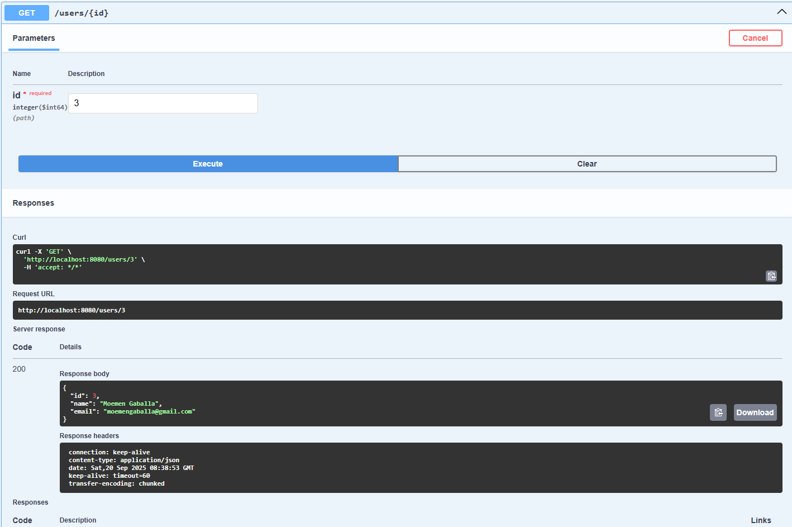

# REST API for E-commerce Platform

A Spring Boot based RESTful API to manage users & products for an e-commerce platform.  
Supports full CRUD operations (Create, Read, Update, Delete) for both users and products.

---

## Features

- Full CRUD operations for **Users**
    - List all users
    - Create (store) user
    - Show a single user by ID
    - Update user by ID
    - Delete user by ID

- Full CRUD operations for **Products**
    - List all products
    - Create (store) product
    - Show a single product by ID
    - Update product by ID
    - Delete product by ID

---

## Tech Stack

| Component   | Technology / Library |
|-------------|-----------------------|
| Language    | Java |
| Framework   | Spring Boot |
| Build Tool  | Maven |
| Database    | MySQL |
| ORM         | Spring Data JPA |
| Migration   | Flyway |
| Docs        | Swagger / OpenAPI (springdoc-openapi) |
| Others      | Lombok, MapStruct |

---

## API Documentation (Swagger)

Once the application is running, you can access the interactive API docs at:

- **Swagger UI**: [http://localhost:8080/swagger-ui.html](http://localhost:8080/swagger-ui.html)

Example Swagger view:



---

## Installation

1. Clone this repository:
   ```bash
   git clone https://github.com/Moemen-Gaballah/Rest-API-for-e-commerce-platform.git
